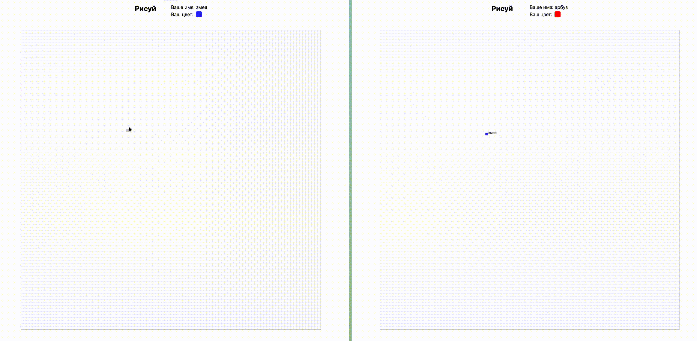

# Pixelboard

Совместный пиксельный холст в реальном времени.

Рисование вместе с другими пользователями. Механика вдохновлена r/place, возможность видеть курсоры игроков как в Figma (почти)

## Demo


## Стек
- **Backend**: Go + centrifuge (WebSocket)
- **Frontend**: Vue 3

## Запуск в dev окружении
1. docker compose up
2. http://localhost:5173

## Как это работает
- Холст 100×100 пикселей, хранится в памяти приложения
- Rate limit: 1 пиксель каждые 500ms (без накопления) на игрока
- Курсоры с throttle 30fps

## Билд
1. ```docker compose exec -it node bun run build``` - Билд фронта
2. ```docker compose exec -it app go build cmd/board/main.go ``` - Билд бинарного файла

## Известные проблемы
- После выхода или рефреша страницы остается курсор игрока
- Не прокинут хост сервера в .env
- При движении курсора исчезают другие игроки

P.S Скорее всего не буду чинить